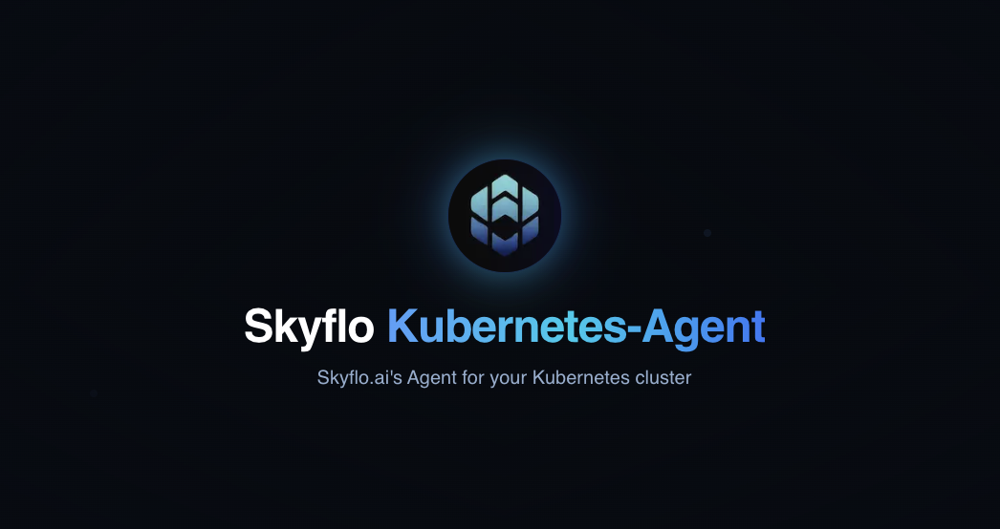

# Kubernetes Agent

<p align="center">
  
</p>

<div align="center">

  [](https://skyflo.ai)
  [](https://discord.gg/kCFNavMund)
  [](https://x.com/skyflo_ai)
  [](https://www.youtube.com/@SkyfloAI)
  [](LICENSE)
  
</div>

## Crawler and Watcher for Your Kubernetes Clusters

The Skyflo Kubernetes Agent is an open-source tool that scans and monitors your Kubernetes clusters, collecting resource information and sending it to the Skyflo backend for analysis. This enables AI-powered natural language interactions with your Kubernetes infrastructure, making cluster management more accessible and efficient.

## Key Features

- **Comprehensive Resource Discovery**: Scans Kubernetes resources including Pods, Deployments, Services, ConfigMaps, and more
- **Real-time Monitoring**: Watches Kubernetes API events to detect and report resource changes
- **Secure Communication**: Uses JWT authentication and TLS for secure data transmission
- **Minimal Permissions**: Uses fine-grained RBAC policies with least privilege principles
- **Lightweight Deployment**: Runs as Kubernetes resources with minimal overhead
- **Helm Charts**: Easy deployment with infrastructure-as-code templates

## Architecture

The Kubernetes Agent consists of two primary components:

- **Initial Crawler**: A component that performs a comprehensive scan of your Kubernetes resources
- **Real-time Watcher**: A component that captures Kubernetes API events and forwards them to the Skyflo backend

### Crawler Flow

1. The crawler is deployed as a Kubernetes resource via Helm or direct manifests
2. It authenticates with the Skyflo API using a secure JWT token
3. It scans Kubernetes resources across the cluster
4. It processes and formats the resource data
5. It sends the data securely to the Skyflo backend API

### Watcher Flow

1. The watcher is deployed alongside the crawler
2. It captures specific Kubernetes API events
3. It filters events based on relevance to resource changes
4. It formats and enriches the event data
5. It forwards events to the Skyflo backend in real-time

## Tech Stack

- **Core**: Go
- **Kubernetes SDK**: client-go
- **Deployment**: Helm Charts, Kubernetes Manifests
- **Containerization**: Docker
- **CI/CD**: GitHub Actions

## Getting Started

### Prerequisites

Ensure you have the following installed:

- [Docker](https://docs.docker.com/get-docker/)
- [Minikube](https://minikube.sigs.k8s.io/docs/start/) (for local development)
- [Kubectl](https://kubernetes.io/docs/tasks/tools/)
- [Go](https://golang.org/doc/install) (for local development)
- [Make](https://www.gnu.org/software/make/)

### Local Development Setup

1. **Clone the Repository**

   ```bash
   git clone https://github.com/skyflo-ai/kubernetes-agent.git
   cd kubernetes-agent
   ```

2. **Configure Makefile**

   Ensure the `Makefile` is set up correctly. Refer to the [Makefile](Makefile) for available targets.

3. **Set Up Minikube Cluster**

   The `setup-cluster` target initializes a 2-node Minikube cluster with necessary addons.

   ```bash
   make setup-cluster
   ```

4. **Build Docker Images**

   Build the required Docker images using the `docker-build` target.

   ```bash
   make docker-build
   ```

5. **Deploy to Kubernetes**

   Deploy all components to the Kubernetes cluster.

   ```bash
   make deploy-all
   ```

6. **Verify Deployment**

   Check the status of all components.

   ```bash
   make status
   ```

### Production Deployment

For production environments, we recommend using Helm:

```bash
helm repo add skyflo https://charts.skyflo.ai
helm repo update
helm install skyflo-k8s-agent skyflo/kubernetes-agent \
  --namespace skyflo \
  --create-namespace \
  --set agentKey=<your-agent-key>
```

Alternatively, you can use the Skyflo platform to automatically deploy the agent with a simple script.

## Security

The Kubernetes Agent implements multiple layers of security:

- JWT-based authentication for API communication
- TLS encryption for data transmission
- Least privilege RBAC roles and policies
- Event data validation and sanitization
- No persistent storage of sensitive data

## Usage

Once deployed, the Skyflo Kubernetes Agent facilitates various AI-driven operations within your Kubernetes cluster. Here are some common use cases:

### Common Use Cases

#### Compliance and Security

Automate checks for SOC2, GDPR, HIPAA, or PCI compliance. Detect and remediate vulnerabilities in your Kubernetes configurations and security groups.

#### Cost Optimization

Identify underutilized resources, redundant services, and optimize your Kubernetes deployments to reduce costs.

#### Rapid Provisioning

Spin up complex Kubernetes architectures with optimized configurations using natural language instructions.

#### Real-Time Q&A

Interact with your Kubernetes cluster using plain English queries to manage permissions, network access, and resource usage.

## Key Capabilities

- **Compliance Scanning:** Continuously monitor your Kubernetes cluster for compliance with industry standards.
- **Security Audits:** Detect and fix security vulnerabilities automatically.
- **Resource Management:** Optimize resource allocation and reduce unnecessary expenditures.
- **AI-Driven Automation:** Leverage AI agents to handle routine and complex DevOps tasks efficiently.

## Contributing

We welcome contributions! Please see our [Contributing Guide](https://github.com/skyflo-ai/skyflo/blob/main/CONTRIBUTING.md) for details.

### Development Process

1. Fork the repository
2. Create your feature branch (`git checkout -b feature/amazing-feature`)
3. Commit your changes (`git commit -m 'Add amazing feature'`)
4. Push to the branch (`git push origin feature/amazing-feature`)
5. Open a Pull Request

## License

This project is licensed under the Apache License 2.0 - see the [LICENSE](LICENSE) file for details.

## Community

- [Discord](https://discord.gg/kCFNavMund)
- [Twitter/X](https://x.com/skyflo_ai)
- [YouTube](https://www.youtube.com/@SkyfloAI)
- [GitHub Discussions](https://github.com/skyflo-ai/skyflo/discussions)

## Support

- Documentation: [docs.skyflo.ai](https://docs.skyflo.ai)
- Issues: [GitHub Issues](https://github.com/skyflo-ai/kubernetes-agent/issues)
- Enterprise Support: [enterprise@skyflo.ai](mailto:enterprise@skyflo.ai)
