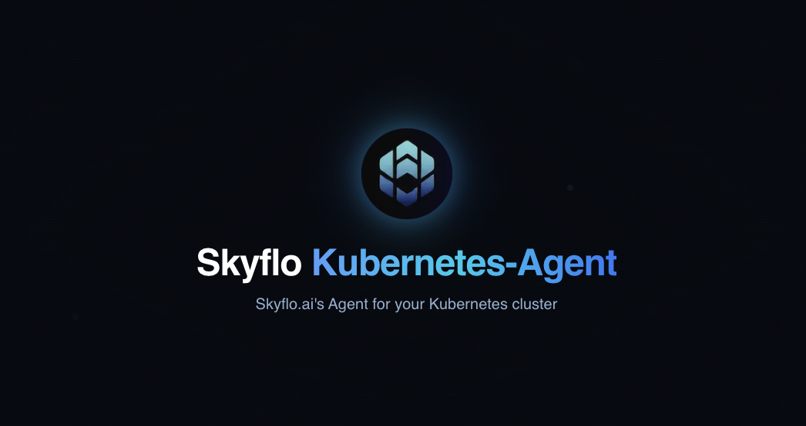

# AWS Crawler

<p align="center">
  
</p>

<div align="center">

  [](https://skyflo.ai)
  [](https://discord.gg/kCFNavMund)
  [](https://x.com/skyflo_ai)
  [](https://www.youtube.com/@SkyfloAI)
  [](LICENSE)
  
</div>

## Crawler and Watcher for Your AWS Environment

The Skyflo AWS Crawler is an open-source tool that scans and monitors your AWS environment, collecting resource information and sending it to the Skyflo backend for analysis. This enables AI-powered natural language interactions with your cloud infrastructure, making AWS management more accessible and efficient.

## Key Features

- **Comprehensive Resource Discovery**: Scans multiple AWS services including EC2, VPC, S3, RDS, IAM, and more
- **Real-time Monitoring**: Watches AWS CloudTrail events to detect and report resource changes
- **Secure Communication**: Uses JWT authentication and TLS for secure data transmission
- **Minimal Permissions**: Uses fine-grained IAM policies with least privilege principles
- **Serverless Deployment**: Runs as AWS Lambda functions with minimal overhead
- **CloudFormation Templates**: Easy deployment with infrastructure-as-code templates

## Architecture

The AWS Crawler consists of two primary components:

- **Initial Crawler**: A Lambda function that performs a comprehensive scan of your AWS resources
- **Real-time Watcher**: An EventBridge rule that captures CloudTrail events and forwards them to the Skyflo backend

### Crawler Flow

1. The crawler is deployed as a Lambda function via CloudFormation
2. It authenticates with the Skyflo API using a secure JWT token
3. It scans AWS resources across multiple services
4. It processes and formats the resource data
5. It sends the data securely to the Skyflo backend API

### Watcher Flow

1. The watcher is deployed as an EventBridge rule via CloudFormation
2. It captures specific CloudTrail management events
3. It filters events based on relevance to resource changes
4. It formats and enriches the event data
5. It forwards events to the Skyflo backend in real-time

## Tech Stack

- **Core**: Go
- **AWS SDK**: aws-sdk-go-v2
- **Deployment**: AWS CloudFormation
- **Runtime**: AWS Lambda
- **Events**: AWS EventBridge
- **Containerization**: Docker
- **Repository**: AWS ECR

## Getting Started

### Prerequisites

- AWS Account with permissions to deploy CloudFormation stacks
- AWS CLI configured with appropriate credentials
- Go 1.23+ (for local development)
- Docker (for local testing)

### Local Development Setup

1. Clone the repository:
   ```bash
   git clone https://github.com/skyflo-ai/aws-crawler.git
   cd aws-crawler
   ```

2. Install dependencies:
   ```bash
   go mod download
   ```

3. Build the crawler:
   ```bash
   go build -o aws-crawler ./cmd/crawler
   ```

4. Run tests:
   ```bash
   go test ./...
   ```

### Deployment to AWS

1. Deploy the crawler using CloudFormation:
   ```bash
   aws cloudformation deploy \
     --template-file crawler-stack.yaml \
     --stack-name skyflo-aws-crawler \
     --capabilities CAPABILITY_IAM
   ```

2. Deploy the watcher using CloudFormation:
   ```bash
   aws cloudformation deploy \
     --template-file watcher-stack.yaml \
     --stack-name skyflo-aws-watcher \
     --capabilities CAPABILITY_IAM \
     --parameter-overrides WatcherEndpoint=https://api.skyflo.ai/v1/webhooks/aws/{agent_id}/continuous-crawl
   ```

Alternatively, you can use the Skyflo platform to automatically deploy the crawler and watcher with a simple script.

## Security

The AWS Crawler implements multiple layers of security:

- JWT-based authentication for API communication
- TLS encryption for data transmission
- Least privilege IAM roles and policies
- Event data validation and sanitization
- No persistent storage of sensitive data

## Contributing

We welcome contributions! Please see our [Contributing Guide](https://github.com/skyflo-ai/skyflo/blob/main/CONTRIBUTING.md) for details.

### Development Process

1. Fork the repository
2. Create your feature branch (`git checkout -b feature/amazing-feature`)
3. Commit your changes (`git commit -m 'Add amazing feature'`)
4. Push to the branch (`git push origin feature/amazing-feature`)
5. Open a Pull Request

## License

This project is licensed under the Apache License 2.0 - see the [LICENSE](LICENSE) file for details.

## Community

- [Discord](https://discord.gg/kCFNavMund)
- [Twitter/X](https://x.com/skyflo_ai)
- [YouTube](https://www.youtube.com/@SkyfloAI)
- [GitHub Discussions](https://github.com/skyflo-ai/skyflo/discussions)

## Support

- Documentation: [docs.skyflo.ai](https://docs.skyflo.ai)
- Issues: [GitHub Issues](https://github.com/skyflo-ai/aws-crawler/issues)
- Enterprise Support: [enterprise@skyflo.ai](mailto:enterprise@skyflo.ai)
